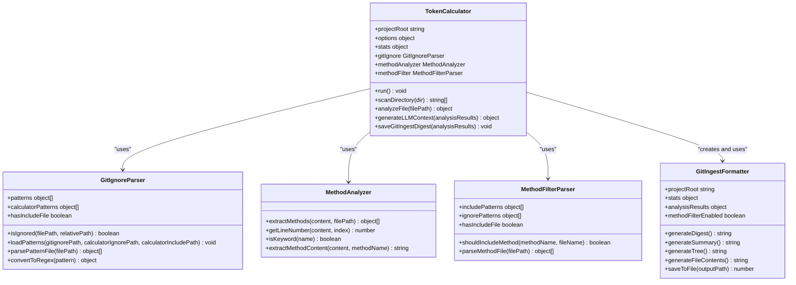
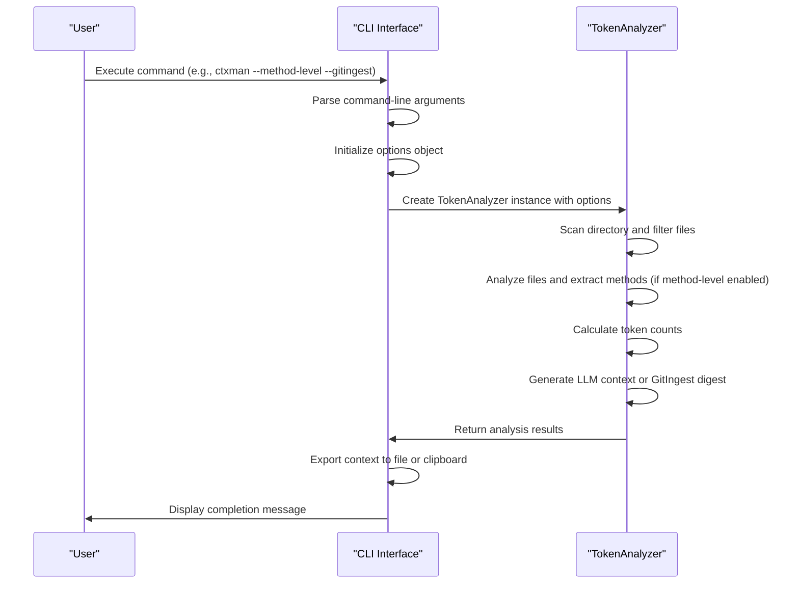
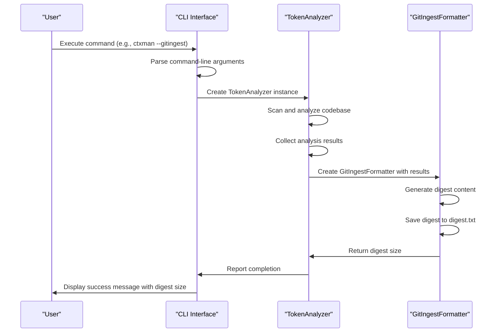
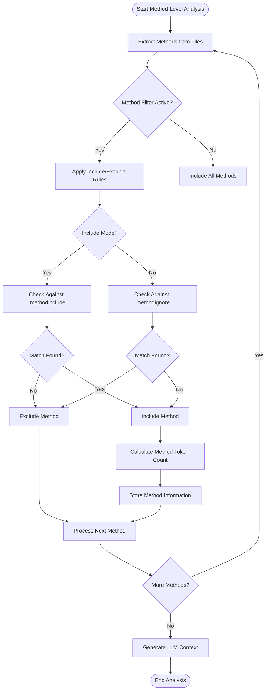
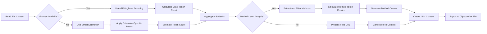
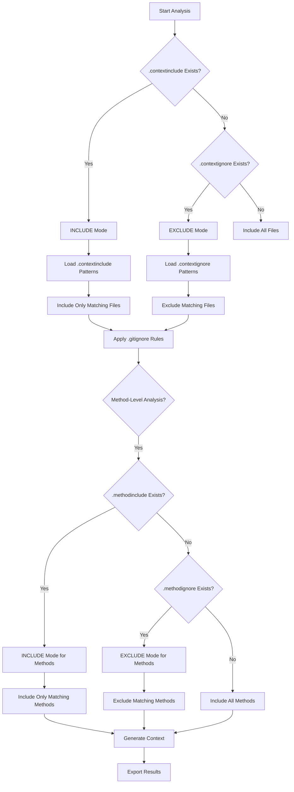

# Tool Overview & Core Value

<cite>
**Referenced Files in This Document**   
- [ctxman.js](file://ctxman.js) - *Updated in recent commit*
- [bin/cli.js](file://bin/cli.js) - *Updated in recent commit*
- [index.js](file://index.js) - *Updated in recent commit*
- [README.md](file://README.md) - *Updated in recent commit*
- [lib/formatters/gitingest-formatter.js](file://lib/formatters/gitingest-formatter.js) - *Added in recent commit*
</cite>

## Update Summary

**Changes Made**

- Added comprehensive documentation for the new GitIngest-style digest formatter feature
- Updated architecture section to include the new GitIngestFormatter component
- Enhanced CLI interface section with new GitIngest export options
- Added new section on GitIngest digest generation workflow
- Updated practical use cases to include GitIngest format examples
- Added new sequence diagram showing GitIngest digest generation

## Table of Contents

1. [Tool Overview & Core Value](#tool-overview--core-value)
2. [Architecture and Component Relationships](#architecture-and-component-relationships)
3. [CLI Interface and Workflow Orchestration](#cli-interface-and-workflow-orchestration)
4. [GitIngest Digest Generation](#gitingest-digest-generation)
5. [Method-Level Analysis and Filtering](#method-level-analysis-and-filtering)
6. [Token Counting and Context Generation](#token-counting-and-context-generation)
7. [Configuration and Filtering Modes](#configuration-and-filtering-modes)
8. [Practical Use Cases and Examples](#practical-use-cases-and-examples)

## Tool Overview & Core Value

The ctxman CLI tool is a specialized utility designed for optimizing code context for Large Language Models (LLMs) through precise token counting, method-level filtering, and generating compact context representations. Its primary purpose is to help developers manage LLM context windows efficiently by providing exact token counts and enabling focused analysis of codebases. The tool supports dual filtering modes (include/exclude) and offers multiple output formats, making it ideal for AI-assisted development workflows, codebase analysis, and CI/CD integration.

The tool's core value lies in its ability to generate ultra-compact context representations that are 89% smaller than full codebases, while maintaining essential information for LLM consumption. It achieves this through method-level analysis, smart file selection, and directory grouping with common prefix compression. The ctxman supports both file-level and method-level analysis, allowing developers to focus on specific business logic methods or analyze entire codebases.

**Section sources**

- [README.md](file://README.md#L1-L891)
- [ctxman.js](file://ctxman.js#L1-L855)

## Architecture and Component Relationships

The ctxman is implemented as a modular, class-based JavaScript application with clear separation of concerns between its core components. The architecture follows a clean dependency hierarchy where specialized classes handle specific aspects of the analysis workflow, and a central orchestrator coordinates their interactions.

The main components include:

- **TokenCalculator**: The central orchestrator that manages the analysis workflow
- **GitIgnoreParser**: Handles file-level filtering based on .gitignore and custom ignore/include rules
- **MethodAnalyzer**: Extracts methods from JavaScript/TypeScript files using regex patterns
- **MethodFilterParser**: Applies include/exclude rules to filter methods based on configuration files
- **GitIngestFormatter**: Generates GitIngest-style digest files for LLM consumption

These components work together in a coordinated manner: the GitIgnoreParser determines which files to include in the analysis, the TokenCalculator processes these files and delegates method extraction to the MethodAnalyzer, the MethodFilterParser filters the extracted methods based on configuration rules, and the GitIngestFormatter generates single-file digest outputs. This modular design allows for independent development and testing of each component while maintaining a cohesive analysis workflow.



**Diagram sources**

- [ctxman.js](file://ctxman.js#L14-L109)
- [ctxman.js](file://ctxman.js#L118-L223)
- [ctxman.js](file://ctxman.js#L225-L790)
- [lib/formatters/gitingest-formatter.js](file://lib/formatters/gitingest-formatter.js#L13-L264)

**Section sources**

- [ctxman.js](file://ctxman.js#L14-L109)
- [ctxman.js](file://ctxman.js#L118-L223)
- [ctxman.js](file://ctxman.js#L225-L790)
- [lib/formatters/gitingest-formatter.js](file://lib/formatters/gitingest-formatter.js#L13-L264)

## CLI Interface and Workflow Orchestration

The CLI interface of the ctxman tool serves as the primary entry point for users and orchestrates the entire analysis workflow. Implemented in the bin/cli.js file, the CLI provides a user-friendly interface with various options for controlling the analysis process. The interface follows a clear execution flow: parsing command-line arguments, initializing the TokenAnalyzer with appropriate options, and executing the analysis.

The CLI supports several key options that control the analysis behavior:

- `--save-report` or `-s`: Saves a detailed JSON report of the analysis
- `--verbose` or `-v`: Shows included files and directories during analysis
- `--context-export`: Generates an LLM context file list
- `--context-clipboard`: Copies the context directly to the clipboard
- `--method-level` or `-m`: Enables method-level analysis
- `--gitingest` or `-g`: Generates GitIngest-style digest file
- `--help` or `-h`: Displays help information

When no export options are specified, the tool enters interactive mode and prompts the user to choose an export option after completing the analysis. This ensures that users never miss the opportunity to export their analysis results in the desired format. The CLI also handles the initialization of the TokenAnalyzer with the current working directory as the project root and processes the command-line arguments to configure the analysis options.



**Diagram sources**

- [bin/cli.js](file://bin/cli.js#L1-L67)
- [ctxman.js](file://ctxman.js#L225-L790)

**Section sources**

- [bin/cli.js](file://bin/cli.js#L1-L67)
- [ctxman.js](file://ctxman.js#L225-L790)

## GitIngest Digest Generation

The ctxman tool now supports generating GitIngest-style digest files - a single, prompt-friendly text file perfect for LLM consumption. This feature was implemented to provide an alternative format that consolidates the entire codebase into a single file with a clear directory tree structure and complete file contents.

The GitIngestFormatter class is responsible for creating these digest files. It takes the analysis results from the TokenCalculator and formats them into a structured text file that includes:

- Project summary and statistics
- Visual directory tree structure using ASCII art
- Complete file contents with clear separators
- Token count estimates formatted in a human-readable way (e.g., "1.2k")

The digest generation process respects all filtering rules, including .gitignore and calculator ignore/include rules. When method-level analysis is enabled, the formatter applies method filtering to include only the specified methods in each file, making the digest even more focused and relevant.

The GitIngest digest can be generated in several ways:

1. Directly from a full analysis: `ctxman --gitingest`
2. From an existing JSON report: `ctxman --gitingest-from-report token-analysis-report.json`
3. From an existing LLM context file: `ctxman --gitingest-from-context llm-context.json`

This two-step workflow allows for performance optimization, as the digest can be generated instantly from existing JSON files without re-scanning the entire codebase.



**Diagram sources**

- [lib/formatters/gitingest-formatter.js](file://lib/formatters/gitingest-formatter.js#L13-L264)
- [ctxman.js](file://ctxman.js#L332-L339)

**Section sources**

- [lib/formatters/gitingest-formatter.js](file://lib/formatters/gitingest-formatter.js#L13-L264)
- [ctxman.js](file://ctxman.js#L332-L339)
- [README.md](file://README.md#L600-L700)

## Method-Level Analysis and Filtering

The ctxman tool provides sophisticated method-level analysis capabilities that allow developers to focus on specific methods within their codebase. This feature is particularly valuable for LLM context optimization, as it enables the extraction of only the most relevant business logic methods while excluding utility, test, and debug methods.

Method-level analysis is controlled by the `--method-level` flag and is implemented through two key components: the MethodAnalyzer and MethodFilterParser classes. The MethodAnalyzer uses a series of regular expressions to identify methods in JavaScript/TypeScript files, supporting various syntax patterns including function declarations, object methods, arrow functions, and class methods. It extracts method names, line numbers, and file paths, creating a comprehensive inventory of methods in the codebase.

The MethodFilterParser applies include/exclude rules to filter methods based on configuration files (.methodinclude and .methodignore). These files use pattern matching syntax that supports exact matches, wildcards (_pattern_), class-specific methods (Class.*), and file-specific methods (file.method). The filtering system supports both include mode (only specified methods are included) and exclude mode (specified methods are excluded), with include mode taking priority when both configuration files exist.



**Diagram sources**

- [ctxman.js](file://ctxman.js#L14-L67)
- [ctxman.js](file://ctxman.js#L69-L109)

**Section sources**

- [ctxman.js](file://ctxman.js#L14-L67)
- [ctxman.js](file://ctxman.js#L69-L109)
- [README.md](file://README.md#L499-L542)

## Token Counting and Context Generation

The ctxman tool provides accurate token counting capabilities essential for LLM context optimization. It uses the tiktoken library for exact token counting compatible with GPT-4, falling back to smart estimation when tiktoken is not available. The token counting system is designed to provide ~95% accuracy even without the tiktoken dependency, making it accessible for various development environments.

The token counting process involves reading file content, calculating tokens based on character-to-token ratios specific to file extensions, and aggregating statistics across the codebase. For exact counting, the tool uses the cl100k_base encoding from tiktoken, which is the same encoding used by GPT-4, ensuring precise context window management. The estimation system uses predefined character-per-token ratios for different file types (e.g., 3.2 for JavaScript, 4.0 for Markdown) to provide reliable approximations.

Context generation is a key feature that produces optimized file lists for LLM consumption in two formats: ultra-compact (default) and detailed. The ultra-compact format generates a structured JSON representation of ~2.3k characters that includes project metadata and organized file paths without token counts, while the detailed format produces ~8.6k characters of comprehensive information including full paths, categories, importance scores, and directory statistics. Both formats use identical JSON structures, ensuring consistency between clipboard and file exports.



**Diagram sources**

- [ctxman.js](file://ctxman.js#L253-L286)
- [ctxman.js](file://ctxman.js#L639-L665)

**Section sources**

- [ctxman.js](file://ctxman.js#L253-L286)
- [ctxman.js](file://ctxman.js#L639-L665)
- [README.md](file://README.md#L499-L542)

## Configuration and Filtering Modes

The ctxman tool supports a flexible configuration system with dual filtering modes (include/exclude) that provide precise control over which files and methods are included in the analysis. This system allows developers to create focused analysis sets tailored to their specific needs, whether they want to analyze only core application logic or include specific files and directories.

The file-level filtering system uses three configuration files with a clear priority hierarchy:

1. `.gitignore` (project root) - Standard git exclusions (always respected)
2. `.contextinclude` - INCLUDE mode (highest priority for files)
3. `.contextignore` - EXCLUDE mode (used when no include file exists)

When `.contextinclude` exists, the tool operates in INCLUDE mode, including only files that match the patterns in this file and ignoring `.contextignore`. When only `.contextignore` exists, the tool operates in EXCLUDE mode, including all files except those matching the ignore patterns. This dual-mode system provides flexibility for different use cases, from comprehensive codebase analysis to focused examination of specific components.

Method-level filtering follows a similar pattern with `.methodinclude` and `.methodignore` files that control which methods are included in the analysis. These files support pattern matching syntax including exact matches, wildcards (_pattern_), class-specific methods (Class.*), and file-specific methods (file.method). The pattern syntax also supports negation (!pattern) to exclude specific items from broad patterns.



**Diagram sources**

- [README.md](file://README.md#L294-L356)
- [ctxman.js](file://ctxman.js#L253-L286)

**Section sources**

- [README.md](file://README.md#L294-L356)
- [ctxman.js](file://ctxman.js#L253-L286)

## Practical Use Cases and Examples

The ctxman tool supports a wide range of practical use cases that enhance AI-assisted development workflows. These use cases demonstrate the tool's versatility in optimizing LLM context, analyzing codebases, and integrating with development processes.

For LLM context optimization, developers can generate minimal context for AI assistants using commands like `ctxman --method-level --context-clipboard`. This creates an ultra-compact representation of the codebase that focuses on core business logic methods, reducing context size by up to 89% compared to the full codebase. By creating a `.methodinclude` file with patterns like `*Handler`, `*Validator`, and `*Manager`, developers can ensure that only relevant methods are included in the context.

Codebase analysis is another key use case, where the tool helps understand project complexity and structure. Running `ctxman --save-report --verbose` generates a detailed JSON report that can be used for historical tracking and CI/CD integration. This report includes comprehensive statistics on file types, largest files, and directory composition, providing valuable insights into codebase health and organization.

The tool also supports method-level debugging by allowing developers to focus on specific problematic methods. For example, to debug authentication methods, a developer can create a `.methodinclude` file with patterns like `*auth*`, `*login*`, and `*validate*`, then run `ctxman --method-level --context-clipboard`. This isolates the relevant methods and provides a focused context for debugging.

CI/CD integration is facilitated through automated token analysis for monitoring codebase growth and complexity. Scripts can run `ctxman --save-report` daily to track token counts and detect potential issues before they impact LLM context limits. Code quality gates can be implemented by checking if the codebase exceeds token budgets, ensuring that projects remain within manageable limits for AI-assisted development.

A new use case enabled by the GitIngest formatter is creating single-file digests for LLM consumption. Developers can run `ctxman --gitingest` to generate a `digest.txt` file that contains the entire codebase in a structured format perfect for pasting into LLM prompts. This is particularly useful for code reviews, documentation generation, and AI analysis workflows.

```mermaid
erDiagram
USER_REQUIREMENT {
string useCase PK
string description
string command
string configuration
string outputFormat
}
USER_REQUIREMENT ||--o{ CONFIG_FILE : "uses"
USER_REQUIREMENT ||--o{ OUTPUT_FORMAT : "produces"
CONFIG_FILE {
string filename PK
string patternSyntax
string mode
}
OUTPUT_FORMAT {
string formatType PK
string size
string content
string useCase
}
USER_REQUIREMENT {
"LLM Context Optimization" "Generate minimal context for AI assistants" "ctxman --method-level --context-clipboard" ".methodinclude with *Handler, *Validator" "Ultra-compact JSON (~2.3k chars)"
"Codebase Analysis" "Understand project complexity and structure" "ctxman --save-report --verbose" ".contextinclude with core JS files" "Detailed JSON report (~8.6k chars)"
"Method-Level Debugging" "Focus on specific problematic methods" "ctxman --method-level --verbose" ".methodinclude with *auth*, *login*" "Method context with line numbers"
"CI/CD Integration" "Monitor codebase growth and complexity" "ctxman --save-report" ".contextignore with test/ and docs/" "Detailed analysis for historical tracking"
"Code Quality Gates" "Ensure code stays within token budgets" "ctxman --method-level --save-report" ".methodinclude with core business logic" "Token count validation"
"GitIngest Digest" "Create single-file digest for LLM consumption" "ctxman --gitingest" ".methodinclude with core methods" "Single-file text digest (~10-50KB)"
}
CONFIG_FILE {
".contextinclude" "**/*.js, !test/**, !docs/**" "INCLUDE"
".contextignore" "**/*.md, **/*.json, node_modules/**" "EXCLUDE"
".methodinclude" "*Handler, *Validator, *Manager" "INCLUDE"
".methodignore" "*test*, *debug*, console" "EXCLUDE"
}
OUTPUT_FORMAT {
"Ultra-compact JSON" "~2.3k chars" "Project metadata, organized file paths" "LLM context optimization"
"Detailed JSON" "~8.6k chars" "Full paths, categories, importance scores" "Codebase analysis"
"Method context" "~4.5k chars" "Method names, line numbers, token counts" "Method-level debugging"
"Detailed report" "~12k chars" "Comprehensive statistics, largest files" "CI/CD integration"
"GitIngest digest" "~10-50KB" "Directory tree, file contents" "LLM consumption, code reviews"
}
```

**Diagram sources**

- [README.md](file://README.md#L499-L542)
- [README.md](file://README.md#L801-L879)
- [lib/formatters/gitingest-formatter.js](file://lib/formatters/gitingest-formatter.js#L13-L264)

**Section sources**

- [README.md](file://README.md#L499-L542)
- [README.md](file://README.md#L801-L879)
- [lib/formatters/gitingest-formatter.js](file://lib/formatters/gitingest-formatter.js#L13-L264)
