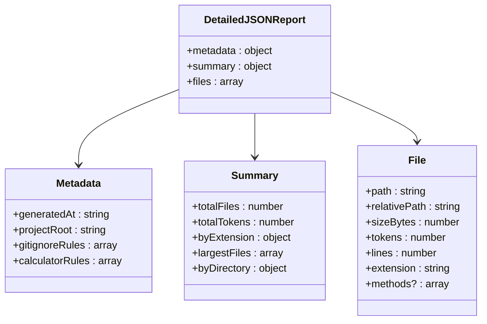
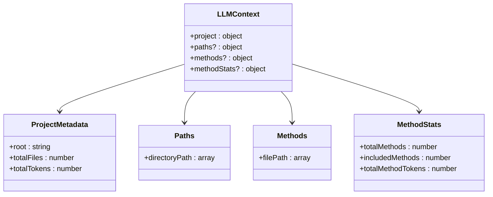
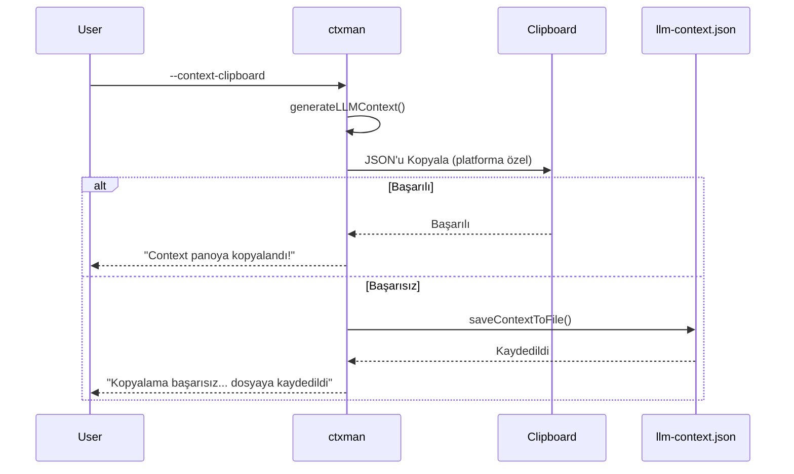

# Çıktı Formatları

<cite>
**Bu Dokümanda Referans Verilen Dosyalar**
- [README.md](file://README.md) - *GitIngest format detayları ile güncellendi*
- [ctxman.js](file://ctxman.js) - *GitIngest oluşturma fonksiyonları eklendi*
- [lib/formatters/gitingest-formatter.js](file://lib/formatters/gitingest-formatter.js) - *Yeni GitIngest formatter uygulaması*
</cite>

## İçindekiler

1. [Giriş](#giriş)
2. [Detaylı JSON Raporu](#detaylı-json-raporu)
3. [LLM Context Formatları](#llm-context-formatları)
4. [Pano Formatı](#pano-formatı)
5. [GitIngest Formatı](#gitingest-formatı)
6. [Kullanım Senaryoları ve Performans](#kullanım-senaryoları-ve-performans)
7. [Parsing Stratejileri](#parsing-stratejileri)

## Giriş

ctxman aracı, AI destekli geliştirme iş akışlarında farklı kullanım senaryoları için üç temel çıktı formatı sağlar. Bu formatlar kod analizi, LLM context optimizasyonu ve proje dokümantasyonunda farklı amaçlara hizmet eder. Araç kapsamlı analiz için detaylı bir JSON raporu oluşturur, hem compact hem de detailed formatlarda LLM context dosyaları oluşturur ve hızlı paylaşım için pano entegrasyonunu destekler. Tüm export formatları dosya ve pano çıktıları arasında tutarlı yapı korur, farklı kullanım senaryolarında güvenilirlik sağlar.

**Bölüm kaynakları**

- [README.md](file://README.md#L1-L891)

## Detaylı JSON Raporu

Detaylı JSON raporu, tam metadata, özet istatistikler, dosya seviyesinde detaylar ve uygulanabilir olduğunda method seviyesinde verilerle kod tabanının kapsamlı analizini sağlar. Bu format `--save-report` flag'i kullanıldığında veya interactive modda uygun seçenek seçildiğinde oluşturulur.

Rapor yapısı üç ana bölümden oluşur:

- **metadata**: Oluşturma zaman damgası, proje kök yolu ve .gitignore ve calculator konfigürasyon dosyalarından konfigürasyon kurallarını içerir
- **summary**: Analiz edilen toplam dosyalar, token sayıları, dosya türü dağılımı ve en büyük dosyalar/dizinler gibi kapsamlı istatistikleri içerir
- **files**: Yol, token sayısı, boyut, satırlar ve uzantı dahil her analiz edilen dosya için detaylı bilgileri içerir

Method seviyesinde analiz `--method-level` flag'i ile etkinleştirildiğinde, dosya nesnelerinde ek method'a özgü veriler dahil edilir ve bireysel fonksiyonlar ve bunların token kullanımı hakkında granüler içgörüler sağlanır.



**Diyagram kaynakları**

- [ctxman.js](file://ctxman.js#L784-L799)

**Bölüm kaynakları**

- [README.md](file://README.md#L1-L891)
- [ctxman.js](file://ctxman.js#L784-L799)

## LLM Context Formatları

ctxman aracı farklı kullanım senaryoları için optimize edilmiş iki farklı LLM context formatı sunar: varsayılan olarak kullanılan ultra-compact format ve `--detailed-context` flag'i ile etkinleştirilen detailed format. Her iki format da token kullanımını minimize ederken AI asistanları için gerekli proje context'ini sağlamak üzere tasarlanmıştır.

### Compact Format (~2.3k karakter)

Varsayılan compact format, JSON formatında yaklaşık 2.3k karakter ile kod tabanının minimal ama yapılandırılmış bir temsilini sağlar. Bu format şunları içerir:

- Proje metadata'sı (kök dizin, toplam dosyalar, toplam tokenlar)
- Ortak önek sıkıştırmasıyla dizine göre gruplandırılmış organize dosya yolları
- Yer tasarrufu için dosya uzantılarının kaldırılması
- Gereksizliği minimize etmek için dizin gruplandırması

Compact format verimliliği önceliklendirir ve token ekonomisinin kritik olduğu sık AI etkileşimleri için idealdir. llm-context.json dosyasıyla tamamen aynı JSON yapısını korur.

### Detailed Format (~8.6k karakter)

`--detailed-context` ile etkinleştirilen detailed format, yaklaşık 8.6k karakterde daha kapsamlı bir context sağlar. Bu format şunları içerir:

- Uzantılarla tam dosya yolları
- Token sayısı ve proje yapısına dayalı önem skorları
- Dizin istatistikleri ve dosya kategorilendirmesi
- Method analizi etkinleştirildiğinde method seviyesinde veriler
- Proje anlayışı için ek metadata

Detailed format ilk proje analizi, kapsamlı dokümantasyon ve daha derin context anlayışı gerektiren durumlar için uygundur.



**Diyagram kaynakları**

- [ctxman.js](file://ctxman.js#L482-L503)
- [ctxman.js](file://ctxman.js#L521-L545)
- [ctxman.js](file://ctxman.js#L505-L519)

**Bölüm kaynakları**

- [README.md](file://README.md#L1-L891)
- [ctxman.js](file://ctxman.js#L482-L545)

## Pano Formatı

ctxman'daki pano formatı, dosya tabanlı export'larla aynı yapıyı korur ve farklı çıktı methodları arasında tutarlılık sağlar. `--context-clipboard` flag'i kullanıldığında, araç llm-context.json'a kaydedilecek olan aynı JSON yapısını doğrudan sistem panosuna kopyalar.

Uygulama platformlar arası pano işlemlerini yönetir:

- **macOS**: `pbcopy` komutunu kullanır
- **Linux**: Önce `xclip`'i dener, mevcut değilse `xsel`'e geri döner
- **Windows**: `clip` komutunu kullanır
- **Diğer platformlar**: Pano işlemi başarısız olursa dosya kaydetmeye fallback sağlar

Pano işlemi herhangi bir nedenle başarısız olursa, araç otomatik olarak context'i llm-context.json'a kaydeder, platform sınırlamalarına bakılmaksızın kullanıcının her zaman çıktıyı almasını sağlar.



**Diyagram kaynakları**

- [ctxman.js](file://ctxman.js#L547-L579)

**Bölüm kaynakları**

- [README.md](file://README.md#L1-L891)
- [ctxman.js](file://ctxman.js#L547-L579)

## GitIngest Formatı

ctxman aracı artık yeni bir çıktı formatını desteklemektedir: GitIngest-style digest dosyaları. Bu format, tüm kod tabanı analizini LLM tüketimi için ideal olan tek, prompt-dostu bir metin dosyasında birleştirir.

### GitIngest Format Genel Bakışı

GitIngest formatı, aşağıdaki bileşenlerle kod tabanının kapsamlı, insan tarafından okunabilir bir özetini sağlar:

- Proje özeti ve istatistikler
- Görsel dizin ağacı yapısı
- Net ayırıcılarla tam dosya içerikleri
- Token sayım tahminleri
- Etkinleştirildiğinde method seviyesi filtreleme

Bu format, [GitIngest](https://github.com/coderamp-labs/gitingest)'ten ilham alınmıştır ve sıfır ek bağımlılıkla saf JavaScript'te uygulanmıştır.

### Oluşturma Methodları

GitIngest digest birden fazla yoldan oluşturulabilir:

**Doğrudan Oluşturma**

```
# Kod tabanı analizinden doğrudan digest oluştur
ctxman --gitingest
ctxman -g
```

**JSON Tabanlı Oluşturma**

```
# Mevcut JSON raporundan digest oluştur (anında, yeniden tarama yok)
ctxman --gitingest-from-report token-analysis-report.json

# LLM context dosyasından digest oluştur
ctxman --gitingest-from-context llm-context.json
```

**İki Adımlı İş Akışı**

```
# Adım 1: Analiz raporu oluştur
ctxman --save-report

# Adım 2: Rapordan digest oluştur (anında)
ctxman --gitingest-from-report token-analysis-report.json
```

### Çıktı Yapısı

Oluşturulan `digest.txt` dosyası şu yapıyı izler:

```
Directory: my-project
Files analyzed: 42
Method filtering: INCLUDE mode active

Estimated tokens: 15.2k
Directory structure:
└── my-project/
    ├── src/
    │   ├── index.js
    │   └── utils.js
    └── README.md


================================================
FILE: src/index.js
================================================
[tam dosya içeriği burada]

================================================
FILE: src/utils.js
================================================
[tam dosya içeriği burada]
```

### Temel Özellikler

- **Tek Dosya Çıktısı**: Kolay LLM alımı için her şey tek bir dosyada birleştirilir
- **Ağaç Görselleştirme**: Uygun girintili net dizin yapısı
- **Token Tahminleri**: Okunabilirlik için "1.2k" veya "1.5M" olarak formatlanmış
- **Sıralı Çıktı**: Dosyalar token sayısına göre sıralanmış (en büyük önce)
- **Filtre Uyumluluğu**: Tüm `.gitignore` ve calculator ignore kurallarına saygı gösterir
- **Method Seviyesi Filtreleme**: Etkinleştirildiğinde, yalnızca filtre kriterlerine uyan methodları içerir
- **Performans Optimize**: JSON tabanlı oluşturma, yeniden tarama olmadan anındadır

### Method Seviyesi Filtreleme

Method seviyesi analiz etkinleştirildiğinde, GitIngest formatter `.methodinclude` ve `.methodignore` yapılandırma dosyalarına dayalı method filtreleme uygular:

- **INCLUDE Modu**: Yalnızca `.methodinclude`'da belirtilen methodlar dahil edilir
- **EXCLUDE Modu**: `.methodignore`'da belirtilen methodlar hariç tutulur

Kod dosyaları için, digest'te yalnızca filtrelenmiş methodlar net açıklamalarla birlikte dahil edilir:

```
// Dosya 15 method içeriyor, 5 filtrelenmiş method gösteriliyor

// Method: calculateTokens (satır 45)
function calculateTokens(content) {
    // method implementasyonu
}

// Method: validateInput (satır 89)
function validateInput(data) {
    // method implementasyonu
}
```

### Uygulama Detayları

GitIngest formatı, `lib/formatters/gitingest-formatter.js`'deki `GitIngestFormatter` sınıfı aracılığıyla uygulanır. Bu sınıf şunları yönetir:

- Proje özet oluşturma
- Dizin ağacı inşası
- Dosya içeriği çıkarma
- Method seviyesi filtreleme
- Çıktı formatlama ve dosya kaydetme

Formatter, method filtreleme yapılandırmasını otomatik olarak algılar ve kod dosyalarını işlerken uygular.

**Bölüm kaynakları**

- [lib/formatters/gitingest-formatter.js](file://lib/formatters/gitingest-formatter.js#L13-L264)
- [ctxman.js](file://ctxman.js#L332-L339)
- [README.md](file://README.md#L600-L700)

## Kullanım Senaryoları ve Performans

Farklı çıktı formatları geliştirme iş akışlarında belirli kullanım senaryolarına hizmet eder:

**Compact Format Kullanım Senaryoları:**

- **LLM Entegrasyonu**: Tam proje context'i ile AI asistanları için yapılandırılmış veri
- **Programatik İşleme**: Otomatik araçlar ve scriptler için JSON formatı
- **Context Paylaşımı**: Pano ve dosya export'larında özdeş format
- **Geliştirme İş Akışları**: CI/CD ve otomasyon için tutarlı yapı

**Detailed Format Kullanım Senaryoları:**

- **Mimari Planlama**: Büyük kararlar için kapsamlı proje genel bakışı
- **Yeni Takım Üyesi Adaptasyonu**: Tam kod tabanı anlayışı
- **Dokümantasyon Oluşturma**: Tam proje yapısı analizi
- **Kod İnceleme Hazırlığı**: Detaylı dosya ilişkileri ve önemi

**Performans Değerlendirmeleri:**

- Compact format, tam kod tabanına kıyasla context boyutunu yaklaşık %89 azaltır
- Token sayımı, mevcut olduğunda GPT-4 uyumluluğu için tiktoken kullanır, tahmin fallback'i ile
- Dizin gruplandırması ve ortak önek sıkıştırması alan kullanımını optimize eder
- Method seviyesinde analiz ek yük ekler ancak odaklanmış hata ayıklama için granüler context sağlar

**Bölüm kaynakları**

- [README.md](file://README.md#L1-L891)

## Parsing Stratejileri

ctxman çıktılarının downstream işlemesi, formatlar arasında tutarlı JSON yapısından yararlanabilir:

**Detaylı JSON Raporları İçin:**

- Audit trail'leri ve versiyon takibi için metadata çıkarın
- Kod tabanı sağlık izleme için dosya seviyesinde istatistikleri analiz edin
- Kritik fonksiyonların odaklanmış analizi için method seviyesinde verileri işleyin
- Uzantı ve dizin istatistiklerinden görselleştirmeler oluşturun

**LLM Context Formatları İçin:**

- Kapsam ve ölçeği anlamak için proje metadata'sını parse edin
- Dizin yapısını yeniden oluşturmak için yol gruplarını gezin
- Hedefli kod analizi için method bilgilerini kullanın
- Yapılandırılmış proje context'ini kabul eden AI araçlarıyla entegre edin

**Genel Parsing Önerileri:**

- İşlemeden önce JSON yapısını doğrulayın
- İsteğe bağlı alanları (methods, methodStats) zarif bir şekilde ele alın
- Büyük raporlar için streaming parser'lar kullanın
- Tekrarlanan işlemden kaçınmak için parse edilmiş sonuçları önbelleğe alın
- Hatalı veya eksik veriler için hata yönetimi uygulayın

**Bölüm kaynakları**

- [README.md](file://README.md#L1-L891)
- [ctxman.js](file://ctxman.js#L482-L545)
